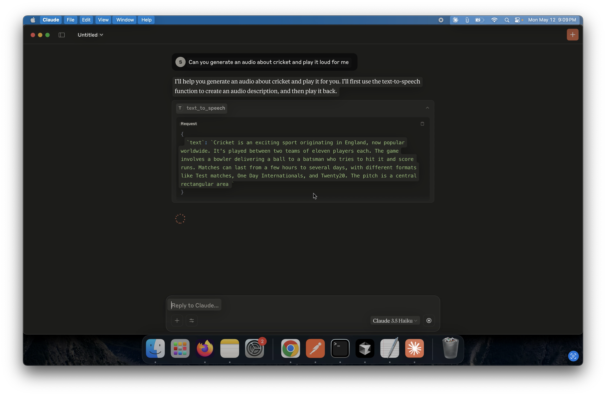

# Deepgram MCP Server

This is a Deepgram MCP (Modular Communication Protocol) server that integrates with Claude Desktop to provide real-time audio generation from text input. It leverages the Deepgram API for audio processing and plays back the generated audio within your MCP-compatible client.

# Demo
[](claude_deepgram_recording.mp4)


## Features

- Converts text to audio using Deepgram
- Plays audio in real-time through Claude MCP
- Easy to configure and run locally

---

## 🚀 Getting Started

### Prerequisites

- Python 3.13 or higher installed on your machine
- A Deepgram API key ([Get one here](https://developers.deepgram.com/))
- Claude Desktop or any other MCP client like Cursor app installed

---

## 🛠️ Installation

### Step 1: Clone the Repository

```bash
git clone https://github.com/your-username/deepgram-mcp.git
cd deepgram-mcp
```

### Step 2: Install Dependencies

This project uses [Poetry](https://python-poetry.org/) for dependency management.

Install Poetry (if not already installed):

```bash
curl -sSL https://install.python-poetry.org | python3 -
```

Install project dependencies:

```bash
poetry install
```

Alternatively, you can manually install from `pyproject.toml`:

```bash
pip install -r requirements.txt
```

---

## 🧩 MCP Server Setup in Claude

### Step 3: Register MCP Server in Claude Desktop

1. Open **Claude Desktop**.
2. Go to **Settings** → **Developer Settings**.
3. Click **Edit Config** to modify the configuration JSON.
4. If the config is empty, add the following block. Otherwise, **merge** this configuration under the `mcpServers` section.

> ⚠️ Replace:
> - `//path to python` with the full path to your Python interpreter.
> - `/absolute/path/to/server.py` with the absolute path to the `server.py` file in this repository.
> - `DEEPGRAM_API_KEY` with your actual Deepgram API key.

```json
{
  "mcpServers": {
    "deepgram-mcp": {
      "command": "/usr/bin/python3",
      "args": [
        "/Users/your-username/path/to/deepgram-mcp/server.py"
      ],
      "env": {
        "DEEPGRAM_API_KEY": "your-deepgram-api-key"
      },
      "description": "Deepgram MCP server to transcribe audio. It is a STT server that uses the Deepgram API to transcribe audio."
    }
  }
}
```

---

## 🧪 Testing the Integration

1. Restart Claude Desktop after saving the configuration.
2. Trigger the MCP client to use the `deepgram-mcp` server.
3. You should hear audio generated from your text input.

---

## 📁 Project Structure

```
deepgram-mcp/
│
├── server.py               # Entry point for the MCP server
├── pyproject.toml          # Dependency & package management
└── README.md               # Documentation
```

---

## 📄 License

This project is licensed under the MIT License.

---

## 🙋‍♂️ Support

For issues or questions, feel free to open an [issue](https://github.com/your-username/deepgram-mcp/issues) or contact the maintainer.
